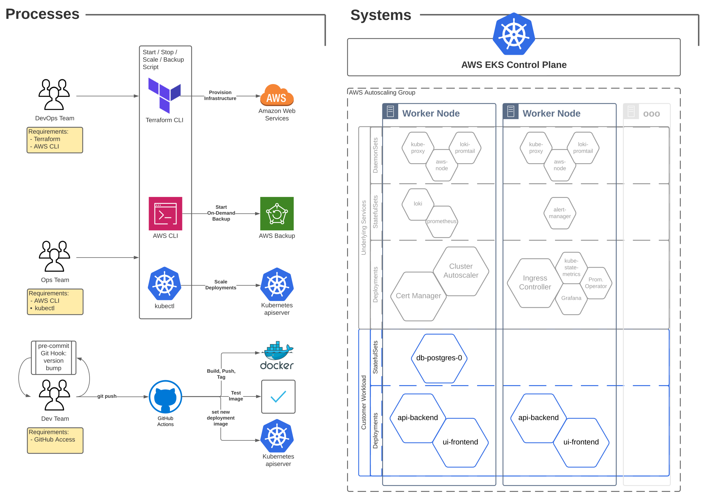

# RealWorld DevOps Stack Demonstration
This project contains application code along with IaC with which to provision it. The resultant stack is operated on by three distinct roles: DevOps Engineers, Operations Teams and App Developers - instructions for each are listed below.

The stack includes monitoring and log collection as well as automated backups of these metrics, logs and the application's underlying database. Furthermore, Github actions are leveraged to provide Continuous Delivery of code triggered by pushes and pull requests that include modifications to the application codebase.

The diagram below gives an overview of the processes and systems used to realise and utilise the stack.




## App Developers
```
git clone <this-repo>
cd <this-repo>
```

For continuous delivery, set up client-side git hooks to automatically bump versions. For git version 2.9 and above this works:
```
git config core.hooksPath .githooks
```

For all versions of Git this works (my preferred):
```
rm -fr .git/hooks && ln -s ../.githooks .git/hooks
```

If your DevOps friends have done everything right, any pushes to origin that include code changes in frontend/ or backend/ will be built, tested and deployed to production.

## Ops Teams
There are a couple of convenience scripts included to make life a little easier.

### Backups
To initiate an on-demand (immediate) backup of any persistent storage in the cluster, either of the following will work:
```
./backup [region]
./runtime backup [region]
```
The default region is `us-west-2`.

Backup script requires aws cli to be installed with your credentials permitted to access the EBS volumes being backed up.

### Scaling up/down
The cluster has infrastructure autoscaling built-in. This means that Kubernetes can request more or less compute resource from AWS and within a short while, the request will be satisfied. To scale, we just ask Kubernetes to make more replicas of our workload - the rest happens spontaneously.
```
./runtime scale frontend 7
./runtime scale backend 2
```

The scaling script requires access to k8s cluster - you must have .kube/config credentials that permit you to scale deployments.

## DevOps Engineers
The cluster deployment relies on `terraform` (and `aws` v2 cli client). It is fully automated and includes an EC2 auto-scaling group controlled from within Kubernetes.

### Prepare
You will want to customise your cluster installation. `terraform/terrafomr.tfvars.sample` is provided as a template.
```
cp terraform/terraform.tfvars{.sample,}
```
Modify the settings as appropriate - you will be prompted for the following if not provided:
* `cm_email` - Email to use for Let's Encrypt CSRs.
* `domain` - The domain that Ingresses will be part of.
* `zone_id` - An AWS Route53 zone that you should setup before continuing - it should correspond with `domain` above.

Ensure you have AWS CLI v2 configured with a role that has permission to create EKS clusters, backup vaults, IAM roles and policies and modify Route53 DNS records.

### Start the cluster
```
./runtime start
```

After starting the cluster, a kubeconfig_xxx file will be dropped in the terraform folder, copy this to $HOME/.kube/config if you want to execute any `kubectl` commands.

### Configure Continuous Delivery
You will need to paste the following secrets into your GitHub repository for the build stage of the pipeline:
* `DOCKERHUB_USERNAME`
* `DOCKERHUB_TOKEN`

Next is a base64 encoded `~/.kube/config` file, i.e. the one outputted after the `./runtime start` operation above.
* `KUBE_CONFIG_DATA`

The config file specifies aws as the source for an EKS authentication token, so the following are also required:
* `AWS_ACCESS_KEY_ID`
* `AWS_SECRET_ACCESS_KEY`
* `AWS_REGION`
